# MyKMeans

- 实现基于Hadoop的KMeans算法

## 运行说明

 - 输入参数
    - cluster_number：聚类数量
    - iterate_number：迭代次数
   - input_path：输入路径，该路径下可以有多个文件
   - output_path：输出路径（再次执行时要确保该目录尚不存在）
   ```
     hadoop jar target/mykmeans-1.0.jar cluster_number iterate_number input_path output_path
   ```

## 设计思路

- 每个map节点读取上一次迭代生成的cluster centers，判断自己节点上的数据归属于哪个cluster
- reduce节点计算每个cluster的数据点，计算出新的cluster centers
- 项目结构设计
  - Instance.java：以ArrayList存放数据点的各个分量，对应文件中原始数据点的格式。边写加法、乘法、除法函数用于计算簇中心。
  - Cluster.java：记录簇的信息，包括id、数据点个数、簇中心
  - KMeans.java：实现KMeans算法。mapper读取每个数据点，通过计算欧氏距离，选择距离最小的簇中心，并输出分类结果；combiner计算新的簇中心；reducer将计算结果进行汇总，计算全局的簇中心。
  - KMeansCluster.java：在最终产生结果后，再对输入文件中的所有实例进行分簇，最后把实例按照（实例，簇id）的方式写入结果文件
  - KMeansDriver.java：启动MapReduce，读取参数
  - RandomClusterGenerator.java：随机生成簇中心
  - Utils：计算距离

## 运行情况

### 输出结果

（仅截取部分）

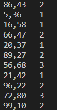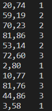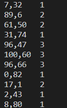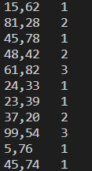

### 监控

#### Yarn

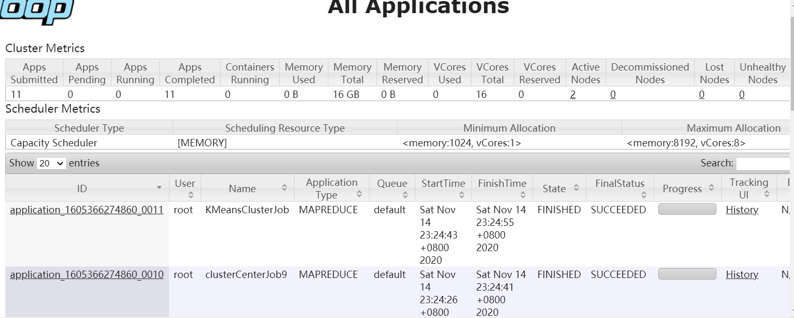

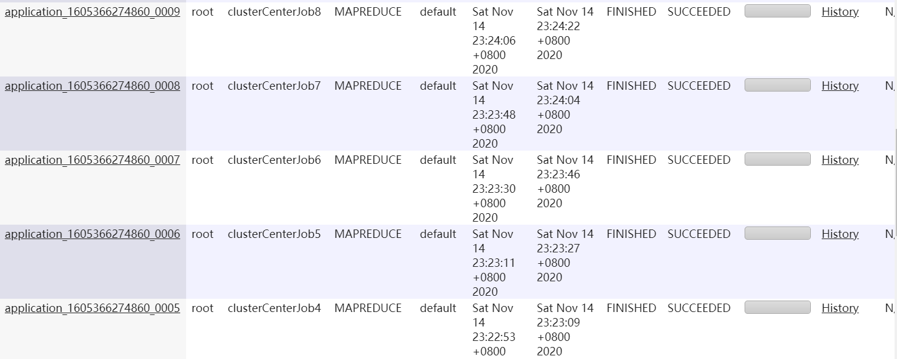

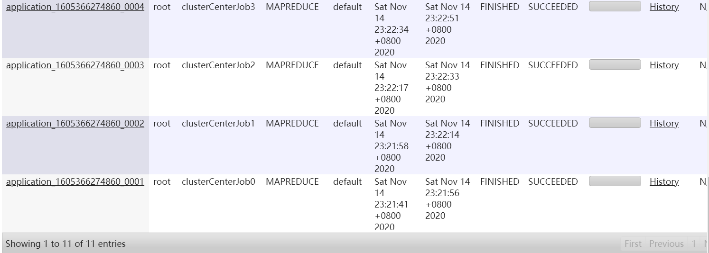

#### HDFS 

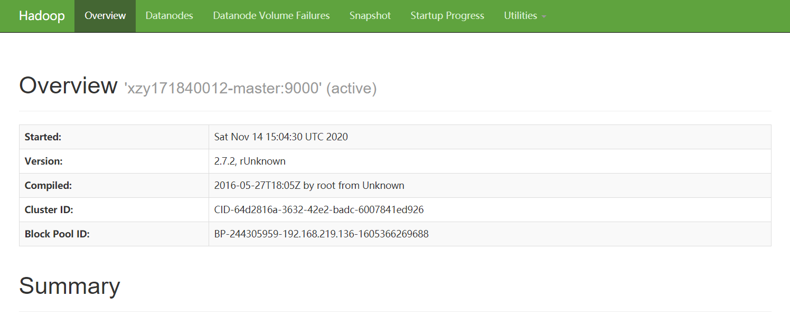

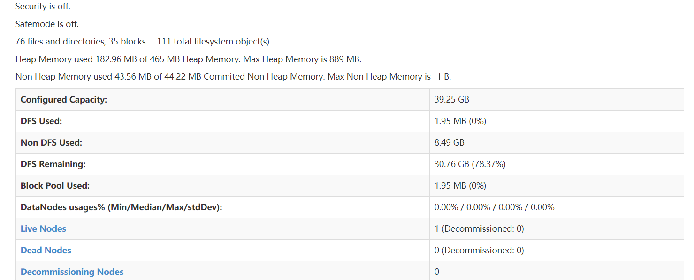

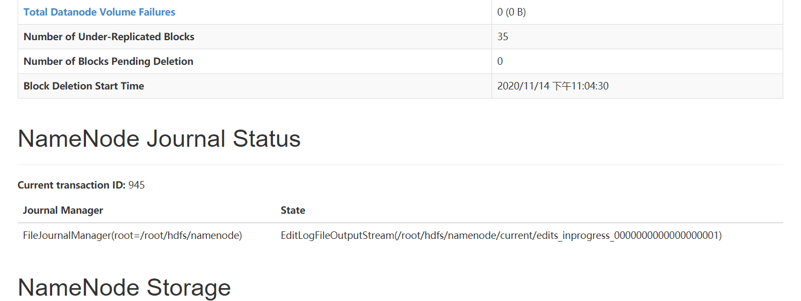

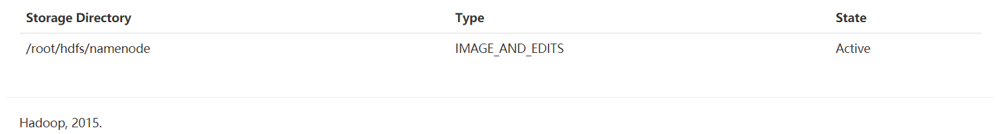

## 可视化

通过python的matplotlib包进行可视化，代码见visualization文件夹。

对于3个簇，10次迭代的聚类，可视化结果如下：

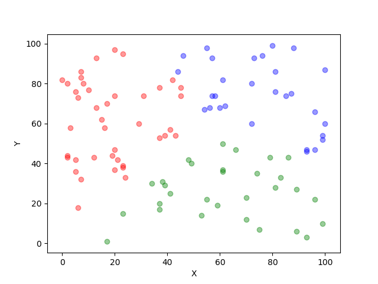
